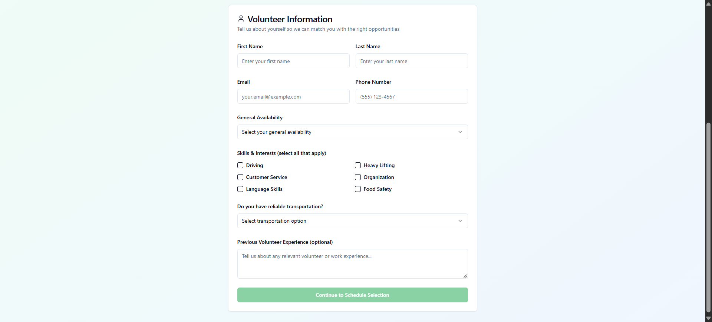
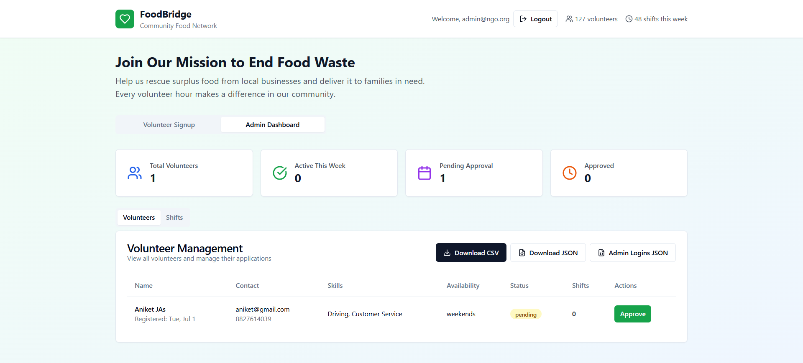

# 👐 Volunteer Signup MVP

A lightweight React + TypeScript web app designed to help local NGOs manage volunteer registrations for food donation drives and community service events.

This MVP focuses on simplifying the volunteer signup process and providing an easy way for NGO admins to view and manage signups — all without needing a backend.

---

## 🖥️ Live Demo

🔗 [Check it out here](https://volunteer-signup-react-ts.vercel.app/)

---

## 🌟 Features

- 📝 **Volunteer Signup Form**  
  Capture name, email, skills, and availability.

- 🧑‍💼 **Admin View**  
  View a list of all signed-up volunteers in a clean table format.

- 💾 **Local Storage Based**  
  No backend needed — data is stored in `localStorage`.

- 🎨 **Modern Minimal UI**  
  Built using TailwindCSS and Shadcn UI for consistent design.

---

## 🖼️ Screenshots

### 📝 Volunteer Signup Form



### 🧑‍💼 Admin Dashboard



---

## 🚀 Getting Started

### ✅ Prerequisites

- Node.js (v16+)
- npm or yarn

### 📦 Clone and Setup

```bash
git clone https://github.com/your-username/volunteer-signup-react-ts.git
cd volunteer-signup-react-ts
npm install
# or
yarn install
```

### ▶️ Run Locally

```bash
npm run dev
# or
yarn dev
```

Open your browser at:  
`http://localhost:5173`

---

## 🗂️ Project Structure

```
src/
├── components/        # UI Components
├── pages/             # Volunteer & Admin Tabs
├── utils/             # Data management (localStorage)
```

---

## 🛠️ Tech Stack

- **React** + **TypeScript**
- **TailwindCSS** + **Shadcn UI**
- **Lucide Icons**
- `localStorage` for data persistence

---

## ⚠️ Notes

- This is a frontend-only MVP using `localStorage`
- Admin tab is public (no authentication/authorization)
- For demo or internal NGO use only — not yet production-ready

---

Made with ❤️ by Aniket Jas.
